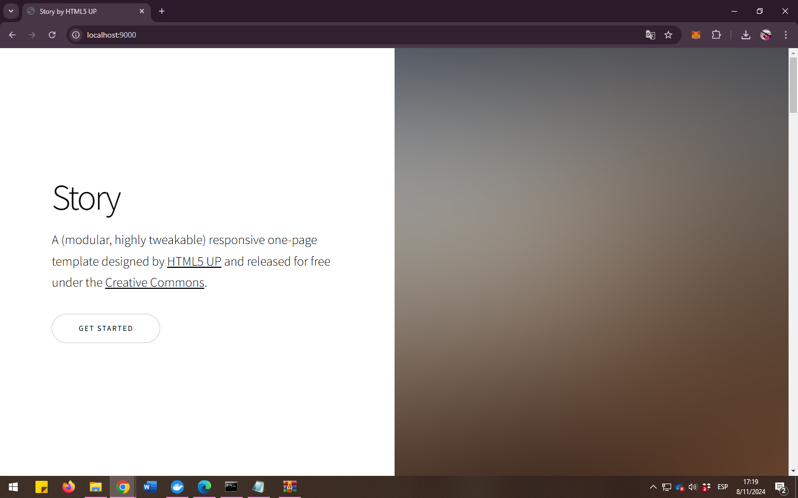

# VOLUMEN TIPO HOST
Un volumen host (o bind mount) es un tipo de volumen donde se monta un directorio o archivo específico del sistema de archivos del host en un contenedor.

```
docker run -d --name <nombre contenedor> -v <ruta carpeta host>:<ruta carpeta contenedor> <imagen> 
```
### En tu computador crear una carpeta llamada nginx y dentro de esta carpeta crea otra llamada html. Como se aprecia en la figura.


### Crear un volumen tipo host con la imagen nginx:alpine, mapear todos por puertos, para la ruta carpeta host colocar el directorio en donde se encuentra la carpeta html en tu computador y para la ruta carpeta contenedor: /usr/share/nginx/html (esta ruta se obtiene al revisar la documentación de la imagen)

# COMPLETAR CON EL COMANDO
docker run -d --name srvNginx -v /c/Users/Marcela/Documents/Practica3/nginx/html:/usr/share/nginx/html -p 9000:80 nginx:alpine

### ¿Qué sucede al ingresar al servidor de nginx?
El error 403 Forbidden aparece cuando Nginx no tiene acceso a los archivos en /usr/share/nginx/html dentro del contenedor. Como estamos montando esta ruta con archivos del host, el error generalmente indica que no hay archivos en el directorio montado, y cuando Nginx intenta acceder a /usr/share/nginx/html no encontrará ningún archivo, lo que provoca el error 403 Forbidden.


### ¿Qué pasa con el archivo index.html del contenedor?
Al ingresar al contenedor se observa que no existe el archivo index.html dentro del directorio /usr/share/nginx/html


### Ir a https://html5up.net/ y descargar un template gratuito, descomprirlo dentro de tu computador en la carpeta html
### ¿Qué sucede al ingresar al servidor de nginx?
Se presenta el contenido de index.html del template descargado.

Al ingresar al contenedor se observa:


### Eliminar el contenedor
docker stop srvNginx (para detener el contenedor)
docker rm srvNginx (para eliminar el contenedor)

### ¿Qué sucede al crear nuevamente el mismo contenedor con volumen de tipo host a los directorios definidos anteriormente?
El contenedor se crea y el directorio del contenedor tiene la misma información que el directorio del host.

### ¿Qué hace el comando pwd?
El comando pwd (print working directory) se utiliza en sistemas operativos basados en Unix (como Linux y macOS) para mostrar la ruta completa del directorio actual en el que te encuentras trabajando en la terminal.
Si quieres incluir el comando pwd dentro de un comando de Docker, lo puedes hacer de diferentes maneras dependiendo del shell que estés utilizando.


### Volumen tipo host usando PWD y PowerShell
```
docker run -d --name <nombre contenedor> --publish published=<valorPuertoHost>,target=<valor> -v ${PWD}/<ruta relativa>:<ruta absoluta> <nombre imagen>:<tag> 
```

### Volumen tipo host usando PWD (Git Bash)

```
docker run -d --name <nombre contenedor> --publish published=<valorPuertoHost>,target=<valor> -v $(pwd -W)/html:/usr/share/nginx/html <nombre imagen>:<tag> 
```

### Volumen tipo host usando PWD (en Linux)

```
docker run -d --name <nombre contenedor> --publish published=<valorPuertoHost>,target=<valor> -v $(pwd)/html:/usr/share/nginx/html <nombre imagen>:<tag> 
```

