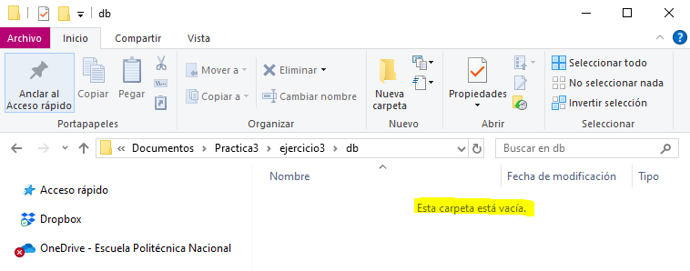

## Esquema para el ejercicio

### Crear red net-wp
docker network create net-wp

### Para que persista la información es necesario conocer en dónde mysql almacena la información.
En el esquema del ejercicio carpeta del contenedor (a) es /var/lib/mysql

Ruta carpeta host: .../ejercicio3/db

### ¿Qué contiene la carpeta db del host?
En este punto la carpeta db esta 

### Crear un contenedor con la imagen mysql:8  en la red net-wp, configurar las variables de entorno: MYSQL_ROOT_PASSWORD, MYSQL_DATABASE, MYSQL_USER y MYSQL_PASSWORD
docker run -d --name srvMysql --network net-wp -e MYSQL_ROOT_PASSWORD=12345 -e MYSQL_DATABASE=bddPractica3 -e MYSQL_USER=emme -e MYSQL_PASSWORD=M123e+ mysql:8

### ¿Qué observa en la carpeta db que se encontraba inicialmente vacía?
La carpeta db ahora contiene 

### Para que persista la información es necesario conocer en dónde wordpress almacena la información.
# COMPLETAR LA SIGUIENTE ORACIÓN. REVISAR LA DOCUMENTACIÓN DE LA IMAGEN EN https://hub.docker.com/
En el esquema del ejercicio la carpeta del contenedor (b) es (COMPLETAR CON LA RUTA)

Ruta carpeta host: .../ejercicio3/www

### Crear un contenedor con la imagen wordpress en la red net-wp, configurar las variables de entorno WORDPRESS_DB_HOST, WORDPRESS_DB_USER, WORDPRESS_DB_PASSWORD y WORDPRESS_DB_NAME (los valores de estas variables corresponden a los del contenedor creado previamente)
# COMPLETAR CON EL COMANDO

### Personalizar la apariencia de wordpress y agregar una entrada

### Eliminar el contenedor y crearlo nuevamente, ¿qué ha sucedido?

# COMPLETAR CON LA RESPUESTA A LA PREGUNTA

