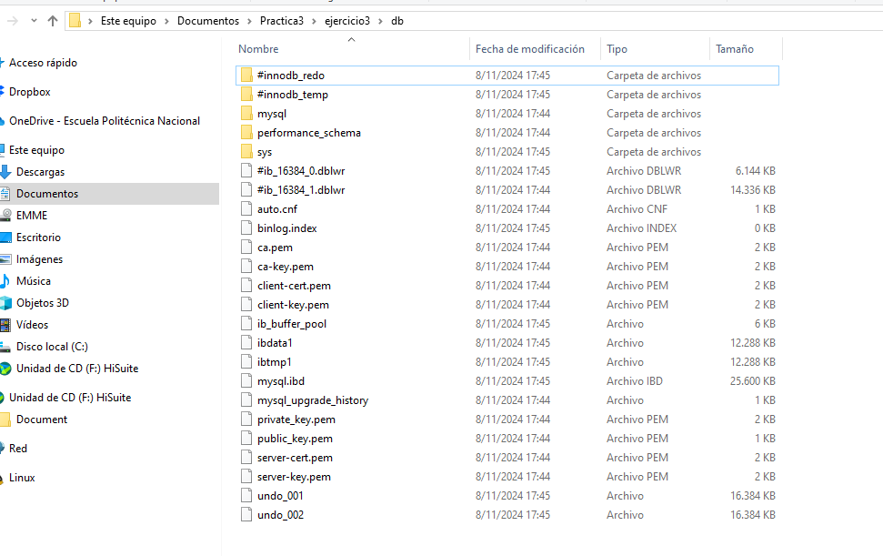

## Esquema para el ejercicio

### Crear red net-wp
docker network create net-wp

### Para que persista la información es necesario conocer en dónde mysql almacena la información.
En el esquema del ejercicio carpeta del contenedor (a) es /var/lib/mysql

Ruta carpeta host: .../ejercicio3/db

### ¿Qué contiene la carpeta db del host?
En este punto la carpeta db esta vacía

### Crear un contenedor con la imagen mysql:8  en la red net-wp, configurar las variables de entorno: MYSQL_ROOT_PASSWORD, MYSQL_DATABASE, MYSQL_USER y MYSQL_PASSWORD y configurando el volumen host de acuerdo al esquema
docker run -d --name srvMysql --network net-wp -e MYSQL_ROOT_PASSWORD=12345 -e MYSQL_DATABASE=bddPractica3 -e MYSQL_USER=emme -e MYSQL_PASSWORD=M123e+ mysql:8

### ¿Qué observa en la carpeta db que se encontraba inicialmente vacía?
La carpeta db ahora contiene archivos y carpetas correspondientes a la base de datos MySQL, que almacenan la estructura y datos de la base de datos creada.

### Para que persista la información es necesario conocer en dónde wordpress almacena la información.
En el esquema del ejercicio la carpeta del contenedor (b) es es /var/www/html

Ruta carpeta host: .../ejercicio3/www

### Crear un contenedor con la imagen wordpress en la red net-wp, configurar las variables de entorno WORDPRESS_DB_HOST, WORDPRESS_DB_USER, WORDPRESS_DB_PASSWORD y WORDPRESS_DB_NAME (los valores de estas variables corresponden a los del contenedor creado previamente)
docker run -d --name srvWordpress --network net-wp -e WORDPRESS_DB_HOST=srvMysql:3306 -e WORDPRESS_DB_USER=emme -e WORDPRESS_DB_PASSWORD=M123e+ -e WORDPRESS_DB_NAME=bddPractica3  -v /c/Users/Marcela/Documents/Practica3/ejercicio3/www:/var/www/html -p 9500:80 wordpress:latest

